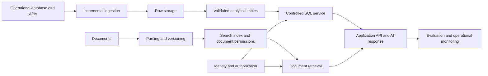

# Sujeet Chouhan: Advanced Python, AI Data Architecture and Reliability

## Project charter

**Audience:** Sujeet Chouhan, an experienced Oracle SQL/PLSQL engineer and database lead with investment-banking, surveillance and fund-accounting experience. The supplied employment dates run from September 2009 to Current; confirm the approximately 17-year total before using it professionally.

**Companion assessment:** Read `Sujeet-Skills-Gap-Assessment.md` first. The assessment distinguishes documented strengths from skills not evidenced in the resume. This roadmap has been personalized from that evidence; no baseline proficiency scores have been invented.

**Objective:** Develop expert-level Python engineering capability alongside the ability to independently design, implement, evaluate and operate a reliable AI data solution, and defend its architectural decisions to technical and business reviewers.

**Confirmed availability and starting point:** 15–20 focused hours per week; little or no hands-on Python or cloud experience. Retain a 24-month depth plan, approximately 1,560–2,080 hours before breaks, with job-readiness reviews beginning much earlier. The first 18 months deliver and refine the integrated platform; months 19–24 deepen Python expertise and operational ownership. Extra hours support practice, review and realistic failures. This is a planning estimate, not a promise of mastery or employment. Adjust after the first four weeks; advance a phase early only when its evidence passes review.

**Job strategy:** Explore bounded SQL/Python transition opportunities from months 4–6 and assess broader data-engineering interview readiness during months 6–9. Read `Sujeet-Market-and-Job-Strategy.md` for employer evidence, experience requirements and interview gates. Do not wait until month 24 to pursue appropriate roles.

**Career direction:** Oracle/database lead → Senior/Lead Data Engineer for financial-services platforms → AI Data Platform Architect or Principal Data Platform Engineer. A hybrid SQL/Python assignment is a practical bridge. Enter at the level supported by demonstrated skills and scope of ownership. Titles vary by employer.

**Scope of AI:** Applied AI data systems, retrieval, evaluation and model lifecycle fundamentals. Training foundation models and advanced ML research require a separate, deeper mathematics and research path.

**Known foundation:** Oracle database development, SQL/PLSQL performance tuning, batch/ETL work, code review, stakeholder collaboration and financial-services domain experience. Do not repeat beginner SQL or assume DBA recovery responsibilities that the resume does not establish.

**Unknowns to resolve:** Exact scheduling/version-control tools, automated testing experience, preferred locations/roles and lab budget. Verify the beginner Python/cloud starting point with simple practical tasks, then teach from that baseline. Pune/India is the initial role-research context from the resume, not a restriction on his options. Begin locally with synthetic data while these are unresolved.

## One project that grows with you

Build a **Financial Data Reliability and AI Investigation Platform** for a fictional investment-services firm. It combines synthetic trades, accounts, instruments, settlement events and surveillance alerts with fictional operating procedures and investigation guides. This connects new engineering skills to his strongest domain knowledge.

Develop it as four connected portfolio releases: (1) reconciled trade-data pipeline, (2) cloud analytics platform with event processing, (3) permission-aware AI investigation assistant, and (4) an operated platform with a reusable Python library. These are releases of one coherent project, not four unrelated systems.

The platform must:

- Ingest database changes, an API feed and documents.
- Produce trusted analytical tables with agreed business definitions.
- Answer numerical questions through controlled SQL queries.
- Answer document questions through retrieval-augmented generation (RAG), with source references.
- Respect user and tenant permissions throughout retrieval, queries, caches and logs.
- Measure answer quality, data freshness, latency, reliability and operating cost.
- Recover from failed jobs, dependency outages and data loss within declared targets.
- Reconcile trade amendments, cancellations and settlement status with precise decimal and timezone handling.
- Demonstrate shadow-running a replacement for a PL/SQL-style batch, with correctness checks and rollback.
- Provide analyst-facing metrics and an audit trail of source versions, transformations and AI evidence.

Use synthetic or openly licensed data. Start with a scale that runs comfortably on your machine. Record hardware and dataset size in every benchmark; expand scale only to answer a specific design question.



## Tool choices

Learn concepts through one coherent stack. My suggested local starting point is Python, SQL, Git, PostgreSQL and Docker. Use PostgreSQL with pgvector for the initial vector-search experiment. Keep your existing database as a source if practical.

Add one orchestration tool when scheduling and recovery requirements justify it; Airflow is a candidate, with final selection based on access and target work. Introduce dbt-style SQL transformations/tests in phase 2, PySpark and one lakehouse table format in phase 3, and a bounded Kafka exercise for event semantics. These enter sequentially, not in the first week.

The recommended default is **AWS plus Databricks/Delta Lake**, informed by the current-role comparison, with Python/PySpark and SQL as the core. This is not a claim about his current team's stack. If approved Azure/Databricks access is available, map the same project to that environment instead of learning two clouds. Learn cloud identity, storage, networking and monitoring before managed processing; use managed services before maintaining a large collection of infrastructure yourself.

Infrastructure as code and deployment automation enter in phase 3. Kubernetes, multiple clouds, multiple vector databases and complex agent frameworks are optional extensions after the core acceptance gates pass.

## Roadmap and acceptance gates

Time windows are estimates. A phase ends when its evidence is reviewable. Strengths can be demonstrated early; gaps should receive more time.

### Phase 1 — Engineering foundations | Months 1–2

**Study:** Python functions and modules, data structures, database drivers, HTTP APIs, pagination, error handling, logging, basic testing, Git, Linux commands, containers, secrets and dependency management. Review SQL only where the baseline exposes gaps.

**Build:** A configurable Python application that reads a sample API and loads PostgreSQL. Package it so another person can run it from documented instructions.

**Acceptance evidence:**

- Repeat the same load without duplicating records.
- Recover after an interrupted load without losing accepted data.
- Handle malformed input, API timeouts and invalid credentials explicitly.
- Keep secrets out of source code and logs.
- Run relevant tests automatically on a proposed code change.

**Month 1:** Baseline assessment, Python/Git practice, first ingestion job.

**Month 2:** Packaging, tests, logging and repeatable local execution.

### Phase 2 — Reliable data engineering | Months 3–5

**Study:** ETL/ELT, dimensional modelling, business grain, incremental loading, change data capture, deletes, slowly changing dimensions, orchestration, data contracts, lineage and reconciliation. Learn event time, duplicates and late-arriving data before claiming streaming guarantees.

**Build:** A raw-to-curated pipeline for trades, accounts and settlement events. Add a warehouse model, versioned SQL transformations, data tests and daily business metrics. Build one simple dashboard to verify those metrics with a consumer.

**Acceptance evidence:**

- Reconcile source and target counts and monetary totals for a defined test period, explaining every expected difference.
- Replay a period and backfill historical records without corrupting current results.
- Demonstrate updates, deletes, duplicates, late arrivals and a breaking schema change.
- Quarantine invalid records with a clear ownership and recovery process.
- Publish definitions for metrics and freshness, including time zones and cutoffs.
- Demonstrate historical account/instrument dimensions and define the grain of every fact table.
- Compare a synthetic PL/SQL-style reference result with the new pipeline before any cutover claim.

**Month 3:** Batch ingestion and modelling.

**Month 4:** Incremental processing and orchestration.

**Month 5:** Failure cases, reconciliation and operational documentation.

### Phase 3 — Cloud and architecture | Months 6–8

**Study:** Cloud identity, networking, object storage, managed databases, encryption, infrastructure as code, CI/CD, deployment rollback, distributed-system consistency and partitioning. Learn PySpark joins, skew, shuffle and file layout through measured experiments.

**Build:** Deploy the data platform to one cloud with separate development and test configurations. Compare a simple SQL implementation with a Spark version for one workload.

**Acceptance evidence:**

- Recreate the environment from version-controlled configuration; document remaining manual steps.
- Demonstrate least-privilege service access and credential rotation.
- Benchmark latency, throughput and resource usage at two dataset sizes.
- Explain when the simpler implementation is preferable.
- Write architecture decision records for storage, compute, orchestration and deployment.
- Produce an estimated monthly cost at stated usage, compare with observed lab cost and document teardown.

**Month 6:** Cloud foundations and first deployment.

**Month 7:** Distributed processing and performance experiments.

**Month 8:** Automated deployment, rollback and architecture review.

**Complementary exercise:** Process a bounded stream of trade amendments/cancellations using Kafka or an accessible equivalent. Explain partition-key ordering, event time, consumer offsets, late events and replay. Contrast it with batch processing and retain streaming only where a latency requirement justifies it. Include this within the phase budget; extend the phase if the core cloud/Spark gates remain open.

### Phase 4 — Applied AI and evaluation | Months 9–11

**Study:** Basic probability and statistics, vectors and cosine similarity, precision/recall, train/validation/test separation, embeddings, token limits, chunking, hybrid retrieval, reranking and grounded answers. Understand the differing purposes of prompting, retrieval and fine-tuning.

**Build:** Add search over fictional investigation procedures and cited answers for analysts. Route numerical trade/settlement questions to a restricted SQL service with vetted query templates or validated queries over approved views. Keep analytical computation in the data layer. Introduce probability, sampling and evaluation statistics before drawing conclusions from AI experiments.

**Acceptance evidence:**

- Create a versioned evaluation set of at least 100 representative questions, including unanswerable, stale, conflicting and permission-restricted cases.
- Maintain a held-out subset that is not used for tuning; record results separately.
- Compare keyword search, vector search and a hybrid approach on the same questions.
- Measure retrieval success, answer correctness, source support, abstention, latency and cost separately.
- Update or delete a document and verify that the old content stops influencing retrieval.
- Demonstrate database-enforced read access, query limits and tenant isolation.
- Test malicious instructions embedded in documents and inappropriate tool-use requests.

**Month 9:** AI foundations, document ingestion and retrieval baseline.

**Month 10:** RAG responses, evaluation and structured-query routing.

**Month 11:** Retrieval experiments, permissions and regression testing.

**Current AI complement:** After the basic RAG gates pass, add one bounded tool-using workflow for an investigation request: retrieve procedures, query an approved read-only view, assemble evidence and request human review. Measure task success, tool-selection failures, latency and cost. Learn context assembly and tool/function schemas; explore MCP only if a real integration requires it. Require authorization outside the model. A graph/entity-resolution exercise is optional if the scenario genuinely needs relationship traversal. Keep these within the AI phase or defer them rather than weakening Python/data foundations.

### Phase 5 — Reliability and AI operations | Months 12–14

**Study:** Service-level indicators/objectives (SLIs/SLOs), error budgets, actionable alerts, tracing, queue lag, retry backoff, idempotency, overload, backup restoration and disaster recovery. Add model/prompt/index versioning, quality regression detection and release rollback.

**Build:** Operational dashboards, runbooks, recovery automation and an evaluation gate for AI changes.

**Acceptance evidence:**

- Run drills for a killed worker, unavailable database, model timeout, corrupted batch, permission change and bad release.
- Restore into a clean environment and reconcile recovered data.
- Measure recovery time and data loss against declared recovery time and recovery point objectives (RTO/RPO).
- Load test normal operation and overload; show backpressure and bounded retries.
- Roll back an AI release that improves speed but reduces answer quality.
- Record incidents, contributing factors and follow-up actions in short postmortems.
- Complete a 30-day observation period with documented traffic and synthetic probes. Label this lab evidence; do not present it as proof of production availability.

**Month 12:** Service objectives, dashboards and alerting.

**Month 13:** Failure drills, restore and overload testing.

**Month 14:** AI release controls and observation period.

### Phase 6 — Architecture leadership and production transfer | Months 15–18

**Study:** Requirements discovery, capacity forecasts, total cost, build-versus-buy, migration sequencing, governance, threat modelling, design reviews and technical communication. Add a small classical ML exercise on synthetic operational anomalies: compare with a rule-based baseline, use temporal validation, explain class imbalance and leakage, and track experiments/artifacts with MLflow or equivalent. This is lifecycle learning, not a claim of a validated financial-risk model.

**Build:** A final architecture dossier and a second business scenario that forces different design trade-offs. Seek a bounded, authorized pilot at work or through a legitimate collaboration with real users.

**Acceptance evidence:**

- Defend two plausible architectures against explicit reliability, quality and cost requirements.
- Show a migration plan, rollback conditions, capacity model and operational ownership.
- Have an independent engineer review the design and reproduce a recovery procedure.
- Deliver a concise business demonstration and a deeper technical walkthrough.
- Produce three case studies with measured outcomes: data correctness, AI quality and reliability.
- Record real-user feedback and improvements where pilot access is available. If unavailable, leave the production-experience requirement open rather than declaring mastery.

**Month 15:** Architecture alternatives and classical ML lifecycle exercise.

**Month 16:** Pilot preparation and independent design review.

**Month 17:** Authorized pilot or expanded simulation; feedback and remediation.

**Month 18:** Capstone defense, portfolio and next development plan.

**Complementary leadership evidence:** A data-product contract naming the consumer, owner, metric definitions, freshness, support path, retention and cost; a short analyst-facing demonstration; and a migration business case grounded in measured data. Seek a Python/pipeline assignment from months 3–6 and assess role readiness at months 6–9 rather than waiting until month 24.

### Phase 7 — Python expertise and sustained ownership | Months 19–24

Python development runs throughout the first six phases using the track below. This final phase deepens understanding through unfamiliar problems, independent review and maintenance across multiple releases.

**Month 19:** Investigate Python's object model, imports, reference lifetimes and memory behavior through focused experiments. Diagnose a retained-object problem with measurements.

**Month 20:** Profile the platform, locate its actual bottleneck and improve it without changing correctness. Compare algorithm changes, batching and concurrency before reaching for native extensions.

**Month 21:** Extract a reusable ingestion or retrieval library with a stable typed interface, build artifacts, documentation and compatibility tests. Validate installation in a clean environment; public publication is optional.

**Month 22:** Have another engineer review the library and use it in a second application. Fix the interface and usability problems they uncover. Read an unfamiliar open-source module and prepare a tested bug fix or review locally.

**Month 23:** Maintain the platform through an upgrade, a schema change and an incident drill. Seek supervised production responsibility if available and explicitly distinguish it from simulation.

**Month 24:** Complete the Python practical defense below, repeat the architecture and recovery review, and update all portfolio evidence. Record remaining gaps and the next six months of practice.

## Python mastery track — integrated throughout

Here, master-level Python means being able to design, debug, optimize, test, explain and maintain substantial Python systems independently. Knowing obscure syntax or finishing a course is insufficient. The target is expert applied engineering for data and AI; interpreter/compiler specialization is an optional further path.

| Period | Knowledge to develop | Practical evidence |
|---|---|---|
| Months 1–2 | Mutability, identity/equality, scope, functions, exceptions, comprehensions, modules, standard collections, complexity, Unicode, dates/time zones and decimal arithmetic | A tested loader; explain aliasing, mutable defaults and resource cleanup; choose correct types for money and timestamps |
| Months 3–5 | Iterators/generators, context managers, decorators, closures, dataclasses, composition, typing, protocols, generics and API boundaries | Stream input larger than the chosen memory budget; design interchangeable source adapters; add static checks and validate untrusted inputs at runtime |
| Months 6–8 | Database transactions and pooling, parameterized SQL, serialization, NumPy array concepts, dataframe operations, vectorization and PySpark execution boundaries | Profile a transformation; demonstrate rollback and batching; explain local versus distributed execution and avoid unnecessary row-by-row work |
| Months 9–11 | Async I/O, tasks, cancellation, deadlines, bounded queues, semaphores, rate limits, threads, processes and synchronization | Build a bounded concurrent ingestion/retrieval worker; test cancellation, timeouts and graceful shutdown; justify its concurrency model |
| Months 12–14 | Unit/integration/contract tests, property-based testing, test doubles, deterministic tests, structured logging, traces, exception design and resource lifecycle | Reproduce race or retry failures; prove tested invariants under injected faults; diagnose a fault from logs and traces |
| Months 15–18 | Package design, pyproject.toml, dependency compatibility, public API evolution, build artifacts, plugin interfaces and migration planning | Produce an installable library used by two components; support an interface change with documented migration and compatibility checks |
| Months 19–21 | Python data model, method resolution, descriptors, attribute lookup, import machinery, bytecode inspection, CPython reference counting/cyclic GC, CPU/memory profiling and GIL/build distinctions | Explain selected runtime behavior with small experiments; diagnose memory growth; present a reproducible performance report |
| Months 22–24 | Maintenance, code review, design simplification, unfamiliar codebases, performance regressions and teaching | Independent review, a second consumer of the library, a locally prepared external bug fix and the final practical defense |

Study metaclasses and descriptors enough to read and reason about framework code. Introduce them into the project only when a simpler design does not meet the requirement. Treat native-extension development as optional specialization after profiling demonstrates a need.

The standard Python build and optional free-threaded builds have different concurrency considerations. Record the interpreter version/build and relevant dependency support in benchmarks; avoid blanket claims that threads always or never provide CPU parallelism. See the [official free-threading guide](https://docs.python.org/3/howto/free-threading-python.html).

### Python assessment gates

1. **Foundation gate, month 2:** Build a small unseen ingestion variation without a tutorial. Explain data structures, exceptions and resource ownership, then handle a reviewer-introduced input failure.
2. **Design gate, month 5:** Add a new source through a documented interface. Demonstrate bounded-memory processing, useful types and tests of business invariants.
3. **Concurrency gate, month 11:** Compare sequential, threaded, asynchronous and process-based approaches on suitable I/O and CPU exercises. Measure throughput and memory; demonstrate bounded work and cancellation without leaked resources.
4. **Operational gate, month 14:** Diagnose an injected timeout/retry defect and a memory-growth issue. Provide reproductions, fixes and regression checks.
5. **Library gate, month 18:** Install the built package in a fresh environment and use it from two components. Demonstrate documented APIs, compatibility checks and a reproducible release process.
6. **Expert practice gate, month 24:** Defend the final library and solve an unfamiliar change request under review. Explain runtime behavior and maintainability trade-offs; teach one advanced concept accurately.

### Final Python practical defense

Deliver a reusable, typed Python library and service from the platform. A reviewer chooses a new connector, a failure case and a workload variation. You must implement the extension, reproduce and fix the failure, and explain performance under the altered workload.

Required evidence: a clean installation, understandable public interfaces, correctness and integration tests, resource cleanup under cancellation, memory/CPU profiles, a concurrency comparison, reproducible benchmarks and a migration note for one breaking change. Interpret coverage as a diagnostic rather than a substitute for meaningful tests.

Complete a short closed-assistance exercise to establish independent ability; normal project work can use documentation and coding assistants. You remain responsible for explaining and validating every accepted change.

## Measurement contract

Set targets before tuning and retain evidence. The following are suggested lab gates, not industry standards or universal production targets:

| Area | Initial measurable gate |
|---|---|
| Data correctness | Zero unexplained discrepancies in the defined reconciliation dataset; replay does not change expected totals |
| Freshness | At least 99% of eligible events visible in curated tables within 15 minutes during a declared test window; report late events separately |
| Retrieval | A relevant permitted source appears in the top five results for at least 90% of answerable held-out questions |
| AI answers | At least 90% acceptable answers under a written human-review rubric; report source support and abstention separately |
| Access controls | Zero unauthorized disclosures in the documented adversarial suite; acknowledge that passing a suite does not prove absence of vulnerabilities |
| Latency | Establish and meet a p95 target under a declared workload; report retrieval-only and complete-answer times separately |
| Recovery | Initial lab RTO of 60 minutes and RPO of 15 minutes; revise architecture or targets openly if these are infeasible |
| Cost | Track cost per 1,000 ingested records and per 100 AI questions, with model, token and traffic assumptions |

For AI metrics, report numerators and denominators and inspect failures. Small test sets provide limited confidence. Use automated graders as supporting evidence and calibrate them against human reviews. Do not treat a successful HTTP response as a correct AI answer.

Availability and quality objectives should be chosen from user needs. Define the request population, exclusions, observation window and error-budget response before reporting compliance.

## Weekly working rhythm

| Activity | Base hours/week |
|---|---:|
| Focused Python study and independent exercises | 4 |
| Project implementation | 7 |
| Tests, evaluation, debugging and failure experiments | 3 |
| Documentation, demonstration and career review | 1 |
| Total committed baseline | 15 |

Use up to five additional hours for cloud labs, architecture review, interview practice or remediation. Python receives further practice within implementation and debugging. From month 4, reserve one or two sessions within these hours for interviews and career evidence. Rebalance study topics after each gate; do not add these activities on top of a 20-hour week.

Every week: finish one reviewable increment and record the evidence. Every four weeks: demonstrate the system, review gaps and revise the next four-week backlog. Every phase: seek an independent review where possible and revisit weak areas before adding more tools.

## First four weeks

1. **Week 1:** Assess SQL, Python, Git, Linux and cloud skills. Validate existing SQL knowledge through an unfamiliar tuning problem. Write the financial-data business problem, select synthetic trades/accounts/instruments and create the repository. Define the first ingestion acceptance test. The companion assessment provides the full 13-week starting backlog.
2. **Week 2:** Implement a small Python loader with configuration, structured logs and connection handling. Explain each component without relying on generated code you cannot understand.
3. **Week 3:** Add incremental state, duplicate handling and recovery after a forced interruption. Test malformed input and a source timeout.
4. **Week 4:** Add automated checks, containerized execution and a setup guide. Ask someone to run the project. Record the first demonstration and adjust the schedule to actual learning speed.

## Portfolio structure to create during implementation

```text
financial-ai-data-platform/
  README.md
  src/                 # ingestion, transformations, retrieval and serving
  tests/               # correctness, contracts, permissions and recovery
  infra/               # repeatable infrastructure and deployments
  evaluation/          # datasets, rubrics and versioned results
  docs/architecture/   # diagrams and decision records
  docs/runbooks/       # operations and recovery procedures
  evidence/            # benchmark, cost, restore and incident reports
```

## How to judge progress toward mastery

Use this scale separately for Python engineering, data engineering, AI evaluation, architecture, reliability, security and technical leadership:

- **0 — Unfamiliar:** Cannot explain or implement the concept yet.
- **1 — Guided:** Can reproduce a tutorial and explain its main steps.
- **2 — Independent:** Can build and troubleshoot an unfamiliar variation.
- **3 — Operational:** Can operate it, recover from failures and justify measured trade-offs.
- **4 — Leadership:** Can adapt it to a new context, review others' work and teach the reasoning.

The month-18 platform target is level 3 across the core areas. The month-24 target adds demonstrated level 4 Python design/review/teaching and deeper evidence in architecture and reliability. If operational evidence is only simulated, mark that limitation explicitly. This is a project assessment rubric, not a recognized credential. Sustained mastery requires repeated work with changing requirements, real users, incident response and independent feedback.

## Credentials and continued study

Choose at most one relevant cloud/data credential during the core project; add an architecture credential later only if it serves the target role. Hands-on evidence remains the main deliverable. A postgraduate degree can deepen theory, but is not a prerequisite for this roadmap.

Keep a quarterly learning review for new AI techniques and platform changes. Prefer small measured experiments over rebuilding the system whenever a new framework appears.

## Reference library

These primary sources support the subjects and technical direction. The sequence, time estimates and acceptance thresholds above are the proposed learning plan, not promises made by these sources. Links reviewed September 19, 2026.

- [Google Site Reliability Workbook](https://sre.google/workbook/table-of-contents/): selected chapters on objectives, monitoring, alerting, incident response, overload and pipelines for phase 5.
- [AWS Generative AI Lens](https://docs.aws.amazon.com/wellarchitected/latest/generative-ai-lens/generative-ai-lens.html): a structured review reference for operations, security, reliability, performance and cost in phases 4–6.
- [Google Cloud: Retrieval-Augmented Generation](https://cloud.google.com/use-cases/retrieval-augmented-generation): conceptual grounding for retrieval, hybrid search and answer-quality evaluation in phase 4.
- [pgvector documentation](https://github.com/pgvector/pgvector): implementation reference for the initial PostgreSQL vector-search experiment.
- [Microsoft Fabric Data Engineer](https://learn.microsoft.com/en-us/credentials/certifications/exams/dp-700/): one possible data-engineering syllabus and credential if Fabric fits the chosen environment.
- [AWS Data Engineer Associate](https://aws.amazon.com/certification/certified-data-engineer-associate/): an alternative syllabus and credential if AWS fits the chosen environment.
- [AWS Solutions Architect Associate](https://aws.amazon.com/certification/certified-solutions-architect-associate/): optional cloud architecture study after practical deployment experience.
- [Python data model](https://docs.python.org/3/reference/datamodel.html): object behavior and language protocols for the advanced Python track.
- [Python asyncio documentation](https://docs.python.org/3/library/asyncio.html): asynchronous I/O and its supporting APIs for the concurrency track.
- [Python Packaging User Guide](https://packaging.python.org/en/latest/tutorials/packaging-projects/): project metadata and distributable package construction for the library track.
- [Python free-threading guide](https://docs.python.org/3/howto/free-threading-python.html): build-specific concurrency behavior and extension compatibility considerations.
- [dbt documentation](https://docs.getdbt.com/): SQL transformation, testing and semantic-layer study for phase 2.
- [Kafka introduction](https://kafka.apache.org/intro/): event and partition concepts for the phase-3 streaming exercise.
- [MLflow tracking](https://www.mlflow.org/docs/latest/ml/tracking): experiment and artifact tracking for the phase-6 ML exercise.
- [Databricks data engineering](https://docs.databricks.com/aws/en/data-engineering): optional platform learning reference if Databricks is selected.
